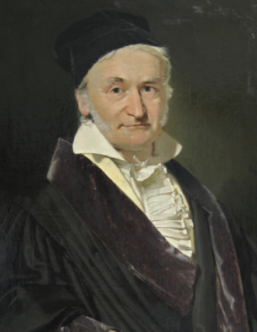
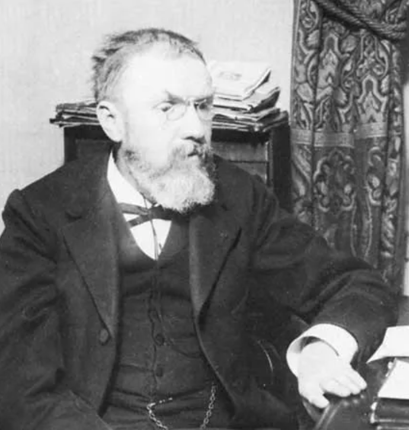
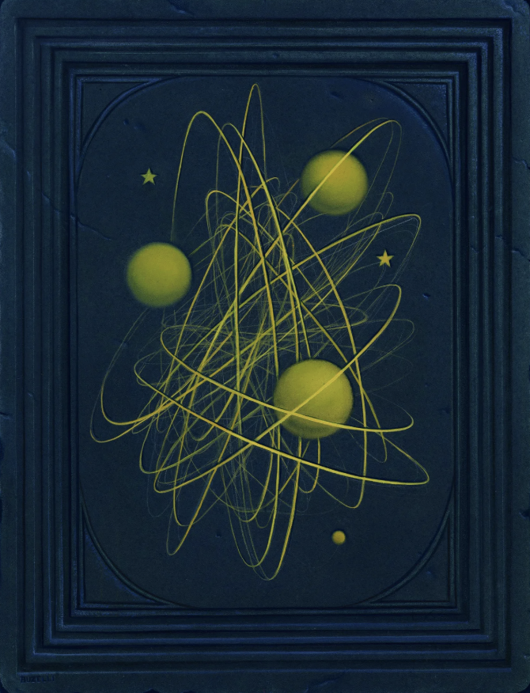
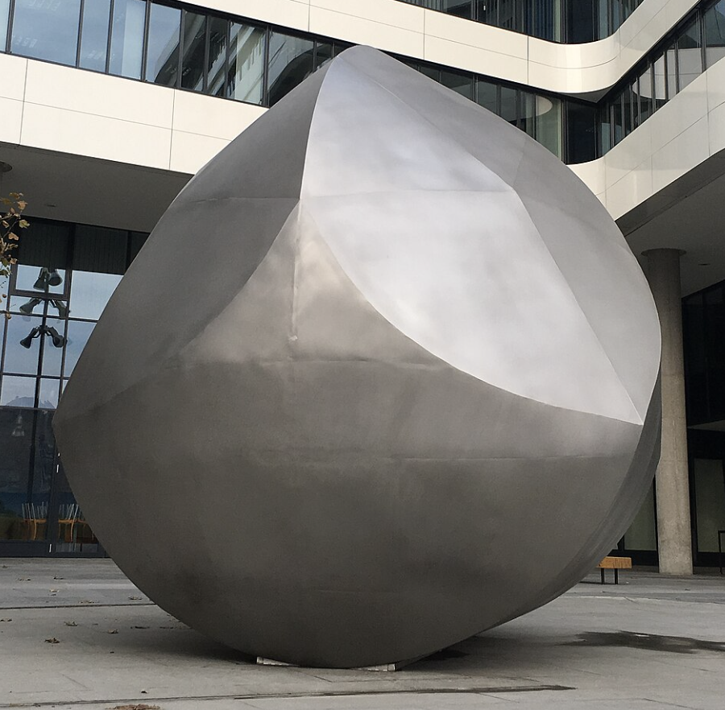

# {.center background-image="assets/maryam.png"}

::: {style="margin-top: 500px; font-size: 2em; color: white; text-shadow: 2px 2px 4px #000000; position: absolute; top: 0; left: 0; width: 100%; height: 100%; display: flex; align-items: center; justify-content: center;"}
March is Women's History Month
:::

## Maryam Mirzakhani

- Iranian mathematician, born in 1977, died in 2017 (cancer)
- First woman and first Iranian to win the Fields Medal (2014) for:
  "her outstanding contributions to the dynamics and geometry of Riemann surfaces and their moduli spaces"
- [film: secrets of the surface](https://www.zalafilms.com/secrets/production.html)

# Deformations of a Torus {background-video="assets/deform_torus.mov" background-size="cover" background-position="center" background-video-loop=true}

## Deformations of a Torus

:::{.incremental}
* First, a riddle:
* How is this talk like  - *publically stating that Gauss, **born on April 30, 1777** was called the "Prince of Mathematicians" because he lived in a castle and has a theorem called Purple Rain?*

::: {#fig-gauss layout-ncol=2}

{width=50%}

{width=60%}

:::

:::

## Defamations of a Taurus

Or ... 

- *publically stating that Henri Poincar&eacute;, **born April 29, 1854** was too clumsy to draw accurately - so he invented topology; and was so careless he actually had to pay to have his own error-laden papers suppressed.* 

::: {#fig-gauss layout-ncol=2}

{width=50%}

{width=50%}

:::

<!--The Arnold principle: "Discoveries are rarely attributed to the correct person" is also named after him.[1]

see: https://en.wikipedia.org/wiki/Stigler%27s_law_of_eponymy-->

## {background-video="assets/indiras_torus.mp4" background-size="contain" background-position="center" background-video-loop=true}

::: {style="position: absolute; bottom: 10px; left: 30px; font-size: 0.5em; color: #7f8c8d;"}
Indira Chatterji: [https://chatterj.perso.math.cnrs.fr/](https://chatterj.perso.math.cnrs.fr/)
:::

## {background-video="assets/indiras_g2surf.mp4" background-size="contain" background-position="center" background-video-loop=true}

::: {style="position: absolute; bottom: 10px; left: 30px; font-size: 0.5em; color: #7f8c8d;"}
Indira Chatterji: [https://chatterj.perso.math.cnrs.fr/](https://chatterj.perso.math.cnrs.fr/)
:::

## {background-video="assets/dehn_twist_indiras.mov" background-size="contain" background-position="center" background-video-loop=true}

::: {style="position: absolute; bottom: 10px; left: 30px; font-size: 0.5em; color: #7f8c8d;"}
Indira Chatterji: [https://chatterj.perso.math.cnrs.fr/](https://chatterj.perso.math.cnrs.fr/)
:::

# {background-image="assets/math_people.jpg" background-size="cover" background-position="center"}

::: {.footer}
[Source: Astabricot's Classroom](https://mathoverflow.net/questions/98548/in-search-of-an-early-picture-of-max-dehn){style="font-size: 1em; color: #eee; text-shadow: 2px 2px 4px #000000;"} 
:::

# {background-image="assets/math_people2.png" background-size="contain" background-position="center"}

::: {.footer}
[Source: <u>Max Dehn Polyphonic Portrait</u> (AMS)](https://www.ams.org/books/hmath/046/hmath046-endmatter.pdf){style="font-size: 1em; color: #eee; text-shadow: 2px 2px 4px #000000;"} 
:::

## {background-image="assets/max_dehn_bio.png" background-size="contain" background-position="center"}

::: {style="position: absolute; top: 10px; left: 0px; font-size: 0.5em; color: #7f8c8d;"}
Image: [Workshop on Max Dehn](https://ems.press/content/serial-article-files/46662)
:::

## {background-image="assets/max_dehn_bmc.png" background-size="contain" background-position="center"}

::: {style="position: absolute; bottom: 10px; left: 150px; font-size: 0.5em; color: white;"}
Black Mountain College ([Notices of AMS, Vol. 64, No. 11](https://www.ams.org/publications/journals/notices/201711/rnoti-p1313.pdf){style="color: white;"})
:::

## {background-image="assets/max_dehn1.png" background-size="contain" background-position="center"}

::: {style="position: absolute; bottom: 10px; left: 150px; font-size: 0.5em; color: white;"}
[Max Dehn](https://joshtanga.github.io/torus/dehn_twist/){style="color: white;"} (photo: Online Journal of BMC Studies (16))
:::

## {background-image="assets/arnold.jpg" background-size="cover" background-position="center"}

::: {style="position: absolute; bottom: 10px; right: 0px; font-size: 1em; color: white"}
Vladimir Arnold - (1937 - 2010)
:::

## G&ouml;mb&ouml;c

{style="position: absolute; bottom: 10px; left: 30px; width: 20%;"}

## Innumumarcy & the Fires of the Inquisition

::: {style="font-family: 'Courier New', monospace; font-size: 1em;"}
> "We live in an insane world, in which most governments behave like the pigs under an oak tree in the fable by Krylov, both eating the acorns and digging up its roots, thus destroying the source of their very sustenance."

> "Even more important than the ability to add fractions is the fact that a basic acquaintance with mathematics allows one to distinguish a correct argument from a faulty one . Without this ability, a society turns into a herd, easily manipulated by demagogues. According to Western experts, in the current situation in Russia, the assumption of power by a Hitler is even more likely than it was in Germany in the 1920s."

> — Vladimir Arnold
:::

Read the full article [here](https://mat.fsv.cvut.cz/soukenkam/ArnoldInquisition.pdf) 

## Arnold's Cat Map

$$\begin{bmatrix}x' \\
y'\end{bmatrix} = \begin{bmatrix}1 & 1 \\
1 & 2\end{bmatrix} \begin{bmatrix}x \\
y\end{bmatrix} \mod 1$$ 

::: {.callout-note title="Theorem" appearance="simple" icon=false}
**A point on the cat map is periodic if and only if its coordinates are rational.**

Let $A$ be the matrix above.  If a point $x$ is periodic, then there exist a positive integer $n$ such that 
$$A^n x - x \in \mathbb{Z}^2, \mbox{ i.e., } (A^n - I)x  = y \in \mathbb{Z}^2.$$  
Since $A$ has integer entries, the matrix $M = A^n - I$ does too.  Furthermore the determinant
$$\det(M) = \det(A^n - I) = \prod_{i=1}^2 (\lambda_i^n - 1)$$ where $\lambda_i$ are the eigenvalues of $A$.  The eigenvalues of $A$ are real and irrational, thus $\lambda_i^n - 1 \neq 0$ for all $n$, so $\det(M) \neq 0$.  

Since $M$ is an integer matrix with nonzero determinant, it is invertible over the rationals, so $x = M^{-1} y$  so $x$ is rational.
:::

::: {.callout-note appearance="simple" icon=false}
Conversely, if $x$ is rational, we can factor out the common denominator $d$ of the entries of $z$ to get $x = \frac{1}{d} z$ for some $z \in \mathbb{Z}$. Then by linearity  $$A^n x - x = \frac{1}{d} (A^n z - z) = \frac{1}{d} (A^n - I) z.$$  If the entries of $A^n - I$ are all multiples of $d$, then this becomes an integer vector, thus congruent to 0 modulo 1 implying that $x$ is periodic.  So we want to show that there exist a positive integer $n$ such that $$A^n \equiv I \mod d.$$  

We'll use the pigeonhole principle.  

**Pigeons**: matrices $A^{n_i}$

**Pigeonholes**: matrices $A^{n_i}$ modulo $d$

Each entry of $A^{n_i}$ modulo $d$ gives $d$ possible values, so there are $d^4$ possible pigeonholes.  The entries of $A^{n_i}$ are (increasing) Fibonacci numbers so clearly there are more pigeons than pigeonholes, so by the pigeonhole principle there must be exist a pair of integers $n_i$ and $n_j$ such that $A^{n_i} \equiv A^{n_j} \mod d$.  

Since $A$ is invertible, we can multiply both sides by $A^{-n_j}$ to get $A^{n_i - n_j} \equiv I \mod d$. 
:::

::: {.callout-note title="Example" appearance="simple" icon=false}
For example, if 
$$x = \begin{bmatrix} \frac{2}{3} \\ \frac{7}{5} \end{bmatrix}$$ 
then we rewrite 
$$x = \frac{1}{15} \begin{bmatrix} 10 \\ 21 \end{bmatrix}$$ so $d = 15$.  
We want to find $n$ such that $$A^n \equiv I \mod 15.$$  
For then 
$$A^n = \begin{bmatrix} 15k + 1 & 15m \\ 15p & 15q + 1 \end{bmatrix}$$ 
for some integers 
$k, m, p, q$ and thus $$A^n x = 
\frac{1}{15} \begin{bmatrix} 10(15k + 1) + 21(15m) \\ 10(15p) + 21(15q + 1) \end{bmatrix} = 
\frac{1}{15} \begin{bmatrix} 150k + 10 + 315m \\ 150p + 315q + 21 \end{bmatrix}$$ 
so
$$A^n x - x = \frac{1}{15} \begin{bmatrix} 150k + 315m \\ 150p + 315q \end{bmatrix} = \begin{bmatrix} 10k + 21m \\ 10p + 21q \end{bmatrix}$$ as desired.
:::

# 

Visualize the Cat Map

# {background-iframe="https://joshtanga.github.io/torus/anosov/"  background-interactive=true}

