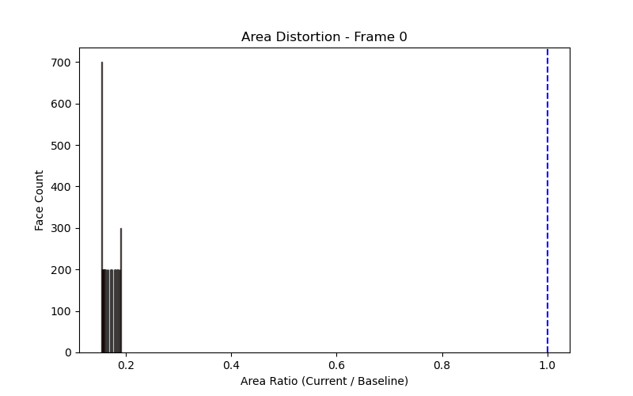
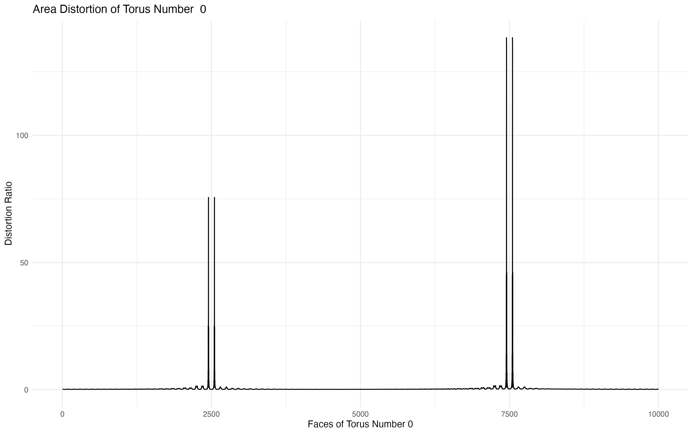

Here we view different geometric structures on a torus.  One aspect of this change is the **metric distortion** — how much the surface area of small neighborhoods stretches or shrinks during the transformation.  

The color mapping uses coolwarm centered at 1.0. This means if a face has the same area as the baseline, it will appear grey/white. If it's larger, it turns red; if smaller, it turns blue. The histogram on the right quantifies this distortion across all faces, showing the distribution of area change.

Note: The drift of the histogram away from 1.0 quantifies how much the geometry is stretching.

::: {layout="[60, 40]"}

::: {#first-column}

<div style="background: #fdfdfd; padding: 20px; border-radius: 8px; border: 1px solid #eee;">
<script type="module" src="https://ajax.googleapis.com/ajax/libs/model-viewer/3.4.0/model-viewer.min.js"></script>

<model-viewer 
    id="torus-scrubber" 
    src="assets/texture_torus_R0_r0.glb"
    camera-controls 
    style="width: 100%; height: 400px;">
</model-viewer>

<model-viewer 
    id="torus-scrubber" 
    src="assets/torus_grid_sweep/torus_R0_r0.glb"
    camera-controls 
    style="width: 100%; height: 400px;">
</model-viewer>


<div style="margin-top: 20px;"><label><strong>Major Radius (R):</strong></label><input type="range" id="slider-R" min="0" max="10" value="9.4" step="1.11" style="width: 100%;">
<label><strong>Minor Radius (r):</strong></label><input type="range" id="slider-r" min="0" max="10" value="2.78" step="0.45" style="width: 100%;"></div>
<p style="text-align: center; margin-top: 10px;"><strong>Current Parameters:</strong> R = <span id="val-R">...</span>, r = <span id="val-r">...</span></p>
</div>


```{=html}
<div class="stats-container">
<div class="stat-box">
    <span class="stat-label">Min Ratio</span>
    <span id="min-val" class="stat-value">1.000</span>
</div>
<div class="stat-box">
    <span class="stat-label">Mean Ratio</span>
    <span id="mean-val" class="stat-value">1.000</span>
</div>
<div class="stat-box">
    <span class="stat-label">Max Ratio</span>
    <span id="max-val" class="stat-value">1.000</span>
</div>
</div>
```


:::

::: {#second-column}

### Geometric Distortion
Top: histogram representing the distribution of area change across all faces. An area-preserving map would result in a single spike at **1.0**

Bottom: distribution of area change across the current surface

<div style="flex: 1; min-width: 300px; text-align: center;">
  
</div>

<div style="flex: 1; min-width: 300px; text-align: center;">
  
</div>


:::

:::

<style>
  .stats-container {
    display: flex;
    justify-content: space-around;
    background: #2c3e50;
    color: white;
    padding: 15px;
    border-radius: 8px;
    font-family: 'Segoe UI', Tahoma, Geneva, Verdana, sans-serif;
    margin: 10px 0;
    box-shadow: 0 4px 6px rgba(0,0,0,0.1);
  }
  .stat-box {
    text-align: center;
  }
  .stat-label {
    display: block;
    font-size: 0.75rem;
    text-transform: uppercase;
    letter-spacing: 1px;
    opacity: 0.8;
  }
  .stat-value {
    display: block;
    font-size: 1.4rem;
    font-weight: bold;
    font-family: 'Courier New', Courier, monospace;
    color: #3498db; /* A nice highlight blue */
  }
  #max-val { color: #e74c3c; } /* Red for Max stretch */
  #min-val { color: #f1c40f; } /* Yellow for Min squeeze */
</style>

```{r, echo = FALSE, message = FALSE, warning = FALSE, results = 'asis'}
library(tidyverse)
library(jsonlite)

# 1. Load the files
# manifest contains filenames/radii, ratios_data contains the actual area numbers
manifest <- read_csv('assets/torus_grid_sweep/manifest.csv') |> janitor::clean_names()
ratios   <- read_csv('assets/torus_grid_sweep/ratios_data.csv') |> janitor::clean_names()

# 2. Calculate stats only on the numeric ratio columns
dist_stats_tidy <- ratios |> 
  summarise(across(
    where(is.numeric), 
    list(
      mean = \(x) mean(x, na.rm = TRUE),
      max  = \(x) max(x, na.rm = TRUE),
      min  = \(x) min(x, na.rm = TRUE)
    ),
    .names = "{.col}_{.fn}"
  )) |> 
  pivot_longer(
    everything(), 
    names_to = c("column_index", "stat"), 
    names_pattern = "x(.*)_(.*)" # Matches "x0_mean", "v1_mean", etc.
  ) |> 
  pivot_wider(names_from = stat, values_from = value) |>
  mutate(column_index = as.numeric(column_index)) |>
  arrange(column_index)

# 3. Bind the radii and filenames from the manifest to the calculated stats
# This ensures each row has: file, r_idx, r_major, r_minor, mean, max, min
combined_payload <- bind_cols(manifest, dist_stats_tidy |> select(-column_index))

# explort combined payload to csv for debugging
write_csv(dist_stats_tidy, "assets/torus_grid_sweep/combined_payload.csv")

# 4. Inject into JS
stats_json <- jsonlite::toJSON(combined_payload)
cat(paste0("<script>var frameStats = ", stats_json, ";</script>"))
```
<script>
    const viewer = document.querySelector('#torus-scrubber');
    const histImg = document.querySelector('#hist-scrubber');
    const distortionImg = document.querySelector('#distortion-scrubber');
    const sliderR = document.querySelector('#slider-R');
    const sliderSmallR = document.querySelector('#slider-r');
    
    const displayR = document.querySelector('#val-R');
    const displaySmallR = document.querySelector('#val-r');

    function updateVisualization() {
        const i = parseInt(document.querySelector('#slider-R').value);
        const j = parseInt(document.querySelector('#slider-r').value);
        
        // This must match the resolution from your Python script (e.g., 6 for 0-5 sliders)
        const RESOLUTION = 10; 
        const idx = (i * RESOLUTION) + j;
        const currentData = frameStats[idx];
    
        if (currentData) {
            // 1. Update the 3D Model
            const viewer = document.querySelector('#torus-scrubber');
            viewer.src = `assets/texture_torus_R${i}_r${j}.glb`;
    
            // 2. Update the Histogram Image & Distortion Image
            const histImg = document.querySelector('#hist-scrubber');
            histImg.src = `assets/torus_plots/dist_plot_${idx}.png`;
            const distortionImg = document.querySelector('#distortion-scrubber');
            distortionImg.src = `assets/torus_grid_sweep/r_dist_plot_x${idx}.png`;
    
            // 3. THE QUICK FIX: Update the text spans
            // because of how R's clean_names() handles the columns.
            document.querySelector('#val-R').innerText = currentData.r_major.toFixed(2);
            document.querySelector('#val-r').innerText = currentData.r_minor.toFixed(2);
    
            // 4. Update the Stats boxes
            document.querySelector('#max-val').innerText  = currentData.max.toFixed(3);
            document.querySelector('#mean-val').innerText = currentData.mean.toFixed(3);
            document.querySelector('#min-val').innerText  = currentData.min.toFixed(3);
            
            // Debugging: This helps us see if the data is actually there
            console.log("Current Frame Data:", currentData);
        } else {
            console.error("Could not find data for index:", idx);
        }
    }

// Attach the function to the sliders
document.querySelector('#slider-R').addEventListener('input', updateVisualization);
document.querySelector('#slider-r').addEventListener('input', updateVisualization);
   // Listen to both sliders
    sliderR.addEventListener('input', updateVisualization);
    sliderSmallR.addEventListener('input', updateVisualization);

    // Initialize on load
    window.addEventListener('load', updateVisualization);
</script>
